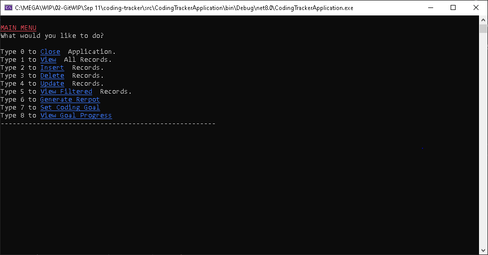
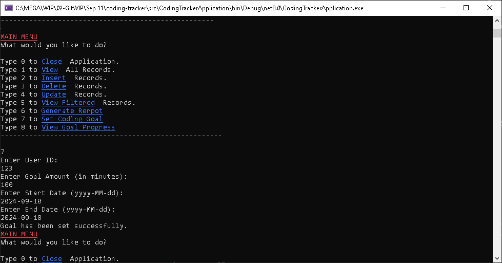
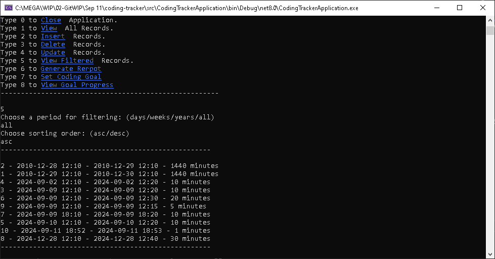
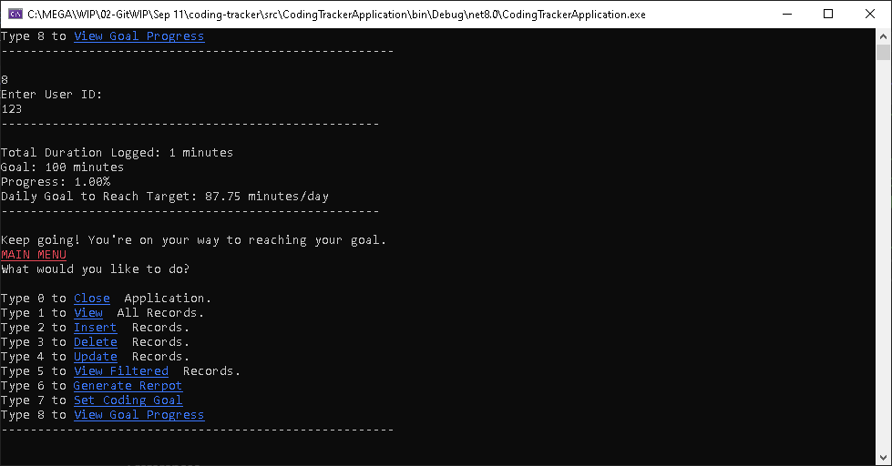
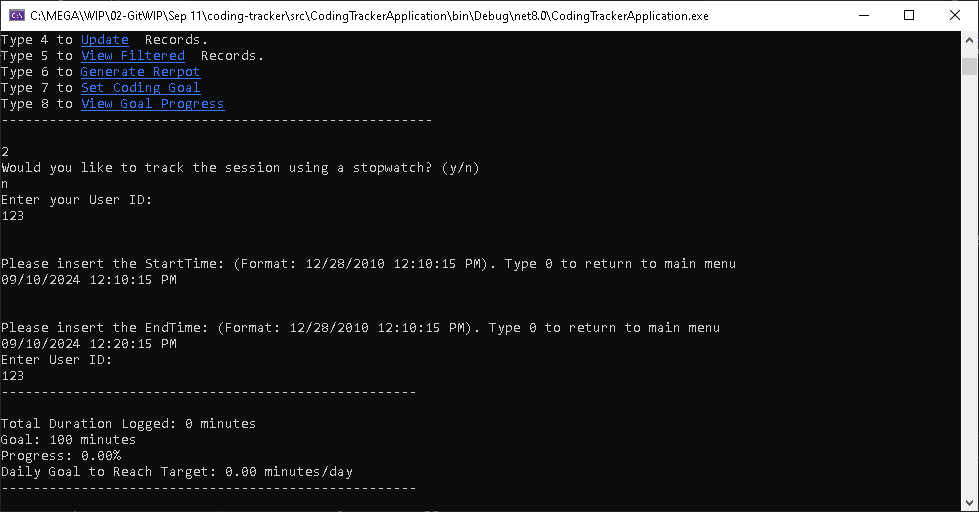
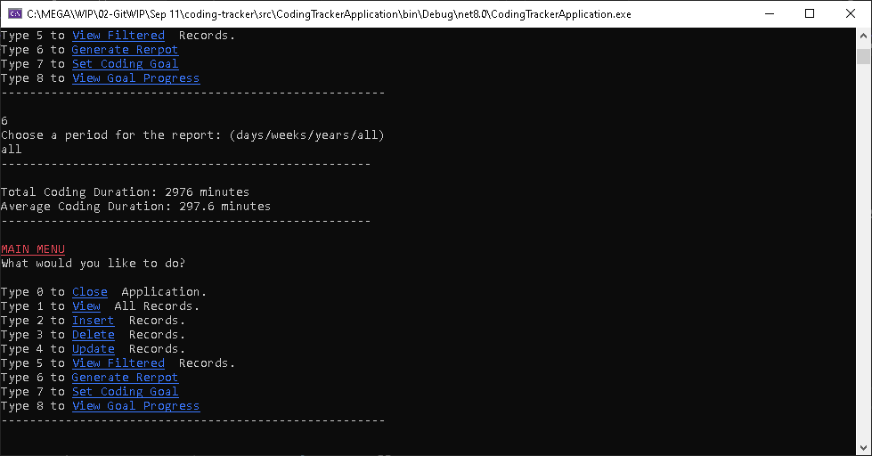
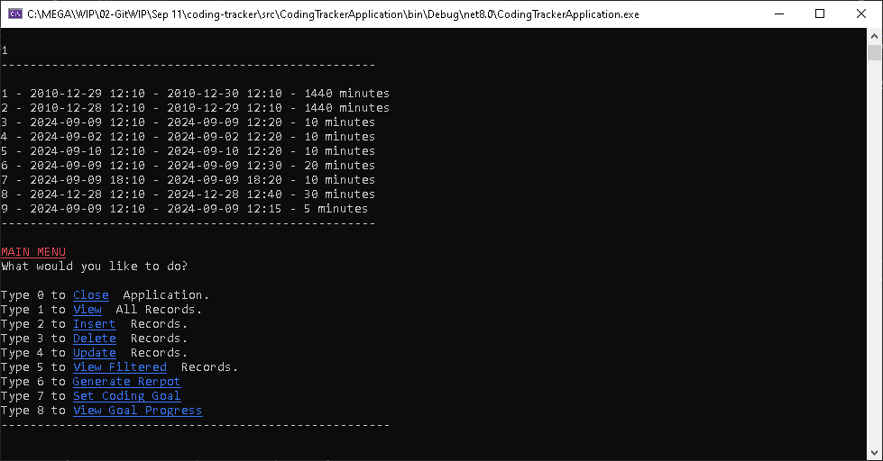
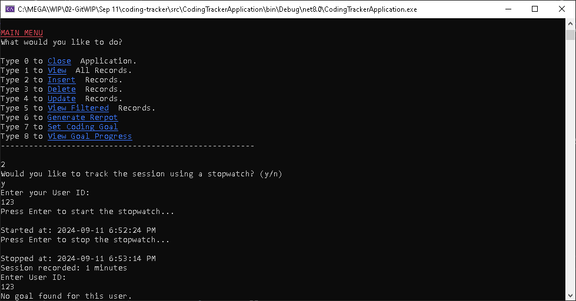

     <h1>CodingTracker</h1> 

Welcome to the CodingTracker App!

This app is designed to help developers track their coding sessions effectively. You can log your coding times, monitor your progress towards goals, and generate reports to review your performance.

This is the C# Console Project #4.

## Features

- **Session Tracking**: Log your coding sessions with start and end times, and calculate total coding duration.
- **Manual or Stopwatch Entry**: You can either manually enter coding session times or use a stopwatch to track your session in real-time.
- **Goal Setting**: Set coding goals for yourself over a specific time frame and track your progress.
- **Session Reports:**: Generate reports to review your total and average coding durations over custom periods.

## Getting Started

### Prerequisites

- .NET 8 SDK installed on your system.

### Installation

#### Console

1. Clone the repository:
	- `git clone https://github.com/Jinboi/coding-tracker.git`

2. Navigate to the project directory:
	- `cd src\\CodingTracker`

3. Run the application using the .NET CLI:
	- `dotnet run`

### Console Screenshots

This is the main menu of the CodingTracker app:

When viewing all recorded coding sessions:

Creating a new coding session manually:

Or using the stopwatch feature for real-time tracking:

You can also generate reports based on various time periods:
__________________

This is the initial screen of the app when you start:

You can set up a goal

You can view records that are filtered.

You can see goal progresses.

You can see manually input your coding session time.

You can see report.

You can see main Menu

You can insert a record.

You can type 5 to add a new habit.

You can also generate reports to view habit performance over time:

You can also generate reports to view yearly performance over time:

## Choose an option:
- **0**: To Close Application
- **1**: To View All Records
- **2**: To Add a New Coding Session
- **3**: To Delete a Coding Session
- **4**: To Update a Coding Session
- **5**: To View Filtered Records
- **6**: To Generate Session Reports
- **7**: To Set a Coding Goal
- **8**: To View Goal Progress
                    
## How It Works

- **Menu Navigation**: Follow the on-screen instructions to log habits, view history, or generate reports.
- **Customizable Habits**: Create habits that are meaningful to you and track them in a way that makes sense.
- **Habit Reports**: Get detailed reports on your habits, including frequency and specific metrics.

## Room for Improvements

- Consider using Spectre.Console for a more polished UI. 
- Additional features like reminders and habit streaks could be added.

## Contributing

- Contributions are welcome! Please fork the repository and create a pull request with your changes. 
- For major changes, please open an issue first to discuss what you would like to change.

## License

- This project is licensed under the MIT License. See the [LICENSE](./LICENSE) file for details.

## Contact

- For any questions or feedback, please open an issue.

---
***Thank you and Happy Coding!***
